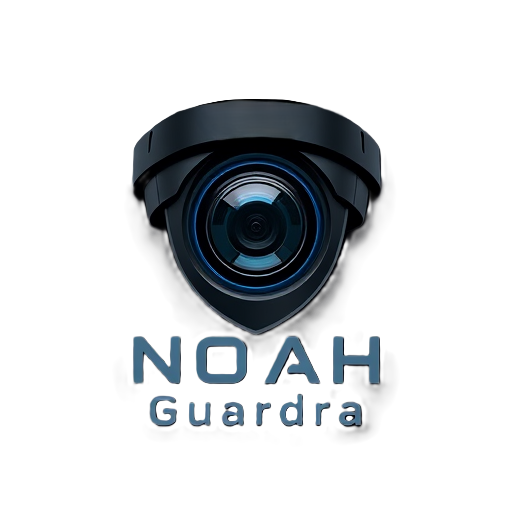

  

# NOAH Guardra — Intelligent NVR & AI Video Surveillance

**NOAH Guardra** is a local network video recorder (NVR) designed for IP cameras, with AI-powered object detection, recording, live viewing, event review, and multi-camera monitoring.

NOAH Guardra is developed and provided by **SonicResume Group**.

[SonicResume Group](https://sonicresume.com)

## Features

* AI-powered object detection
* Support for multiple cameras
* 24/7 video recording
* Event-based video review
* Live camera viewing
* Motion detection
* Configurable recording retention
* RTSP re-streaming
* WebRTC and MSE support for low-latency live viewing
* MQTT integration
* Local processing designed to reduce dependence on cloud services
* Support for a variety of camera and AI-accelerator configurations

## Documentation

NOAH Guardra documentation and product information will be provided by SonicResume Group.

## NOAH Guardra

NOAH Guardra is an independently branded product developed by SonicResume Group using open-source software components.

The NOAH Guardra name, logo, and related branding are property of SonicResume Group.

NOAH Guardra is not an official Frigate product and is not sponsored, endorsed, or affiliated with Frigate, Inc.

## Open-Source Software

NOAH Guardra incorporates software originally developed by the Frigate project.

The applicable source code is licensed under the **MIT License**, subject to the license terms and notices included with the source distribution.

The original Frigate copyright notices and applicable third-party license notices remain part of the software distribution where required.

The **Frigate** name, **Frigate NVR** brand, logos, and other Frigate trademarks are not being claimed as part of the NOAH Guardra brand.

For complete licensing information, see:

* `LICENSE`

## SonicResume Group

**NOAH Guardra is a SonicResume Group product.**

For company and service information:

[SonicResume Group — sonicresume.com](https://sonicresume.com?utm_source=chatgpt.com)

---

**NOAH Guardra**
**A SonicResume Group product**
# noah-guarda
# noah-guarda
