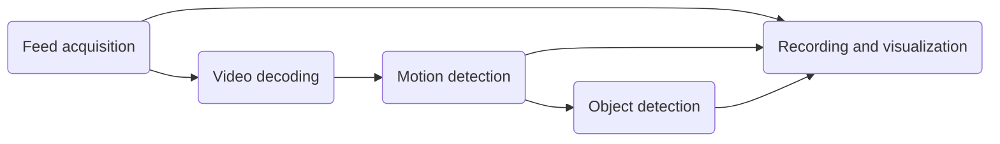

---

id: video_pipeline
title: Video pipeline
---------------------

# Video Pipeline

NOAH Guardra uses a multi-stage video pipeline that starts with the camera feed and progressively processes it through acquisition, decoding, motion detection, object detection, recording, and visualization.

This guide provides an overview of the pipeline and explains how camera streams move through the different processing stages.

## Overview

At a high level, five major processing stages can be applied to a camera feed:

All camera feeds must first be acquired. Depending on the camera and streaming protocol, this may be as simple as using FFmpeg to connect to an RTSP source over TCP or may involve an intermediary such as go2rtc for other supported camera protocols.

A single camera can provide both a main stream and a lower-resolution sub-stream.

Typically, the sub-stream is decoded to produce full-frame images for detection. During this process, the resolution can be downscaled and the frame rate can be limited to the configured detection rate, such as five frames per second.

These frames are then compared over time to identify areas of movement, commonly referred to as motion regions. Motion regions are passed to the object detection system, where an AI model analyzes them for known object classes.

Finally, the configured recording, snap
